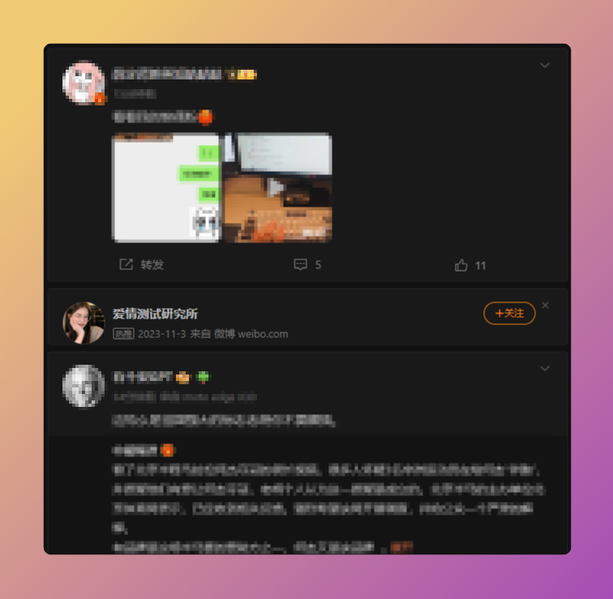
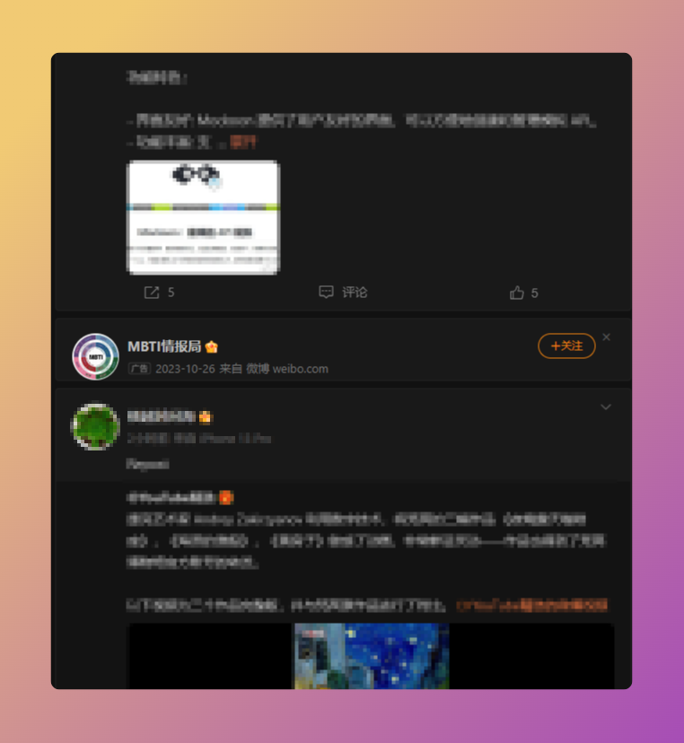
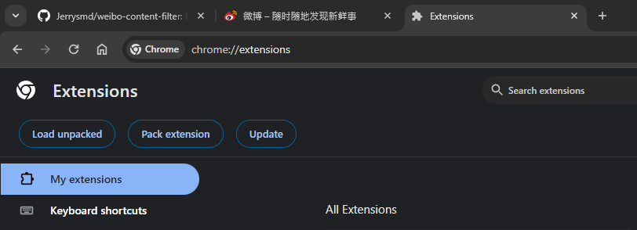
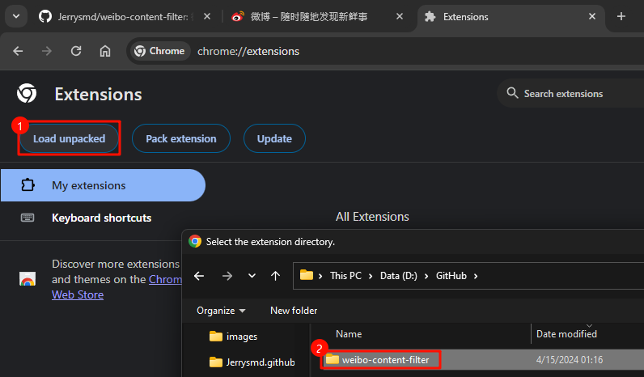
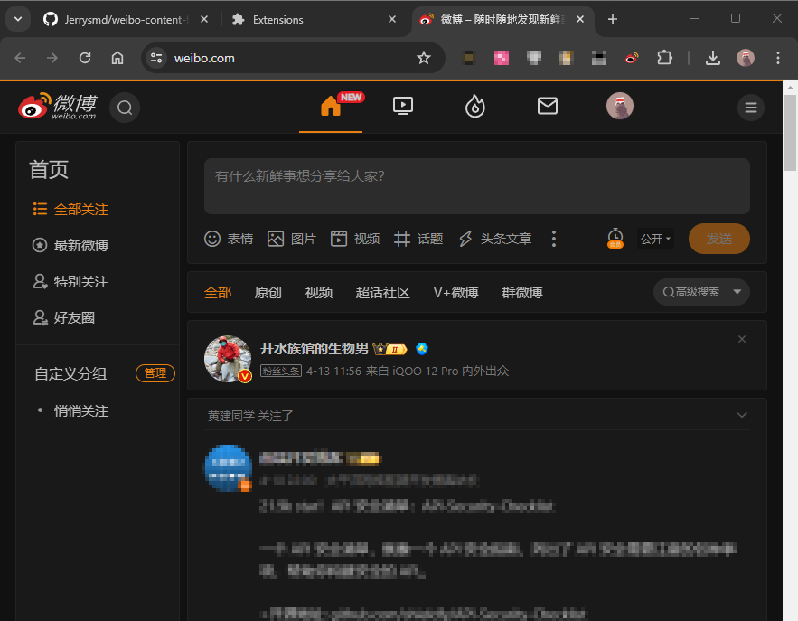

# Weibo Adblocker

# 微博广告屏蔽插件

## Features

+ Block Weibo post with label  `广告` 
+ Block Weibo post with label  `热推` 
+ Block Weibo post with label  `推荐` 
+ Block Weibo post with label  `媒体推荐` 
+ Support custom label blocking

## Screenshot

## How to install this extension

The following uses Chrome on Windows 11 as an example

1. `Download` or `Clone` this repository to your local

2. Go to `chrome://extensions/` in your chrome

   

3. Click `Load unpacked`

   

4. Open the Weibo `https://weibo.com/`

   

## How to customize

If you want to increase the blocking of post with the other label like `粉丝头条` 

1. Open `./weiboClean.js`

2. Add the `粉丝头条` at the end of the code 

   `targetContent.match(/^(热推|推荐|媒体推荐)$/);`

   `targetContent.match(/^(热推|推荐|媒体推荐|粉丝头条)$/);`

3. Reload the `https://weibo.com/`

   

## Why do I keep AD post avatar

+ Make sure the blocker is in effect
+ It is important to know who the advertisers are