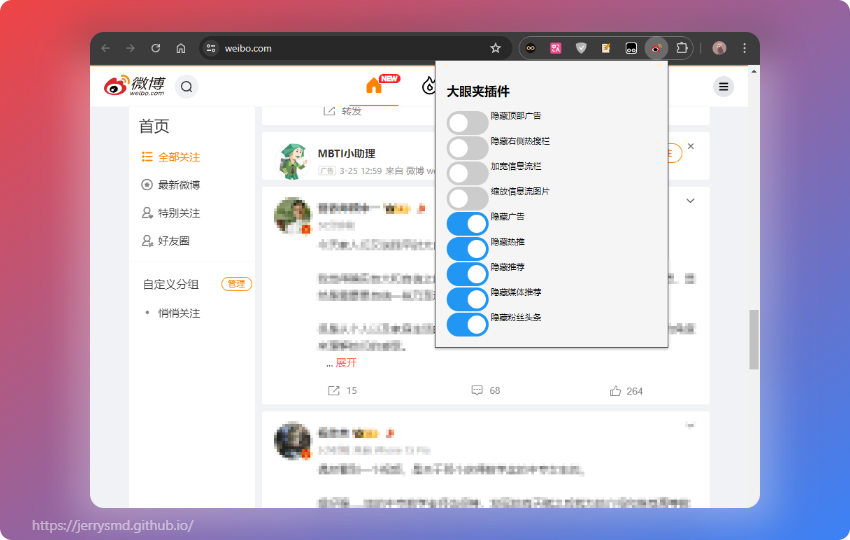

# Weibo Adblocker

# 微博广告屏蔽插件

## Features

+ Block Weibo post with label  `广告` 
+ Block Weibo post with label  `热推` 
+ Block Weibo post with label  `推荐` 
+ Block Weibo post with label  `媒体推荐` 
+ Block Weibo post with label  `粉丝头条` 

## Screenshot

## How to install this extension

The following uses Chrome on Windows 11 as an example

1. `Download` or `Clone` this repository `master bra` to your local

2. Go to `chrome://extensions/` in your chrome

   

3. Click `Load unpacked`

   

4. Open the Weibo `https://weibo.com/`

   

## Why do I keep AD post avatar

+ Make sure the blocker is in effect
+ It is important to know who the enemy is

## TODO List

+ Hide the Top Ads banner
+ Hide the Hot Search column
+ Wide the feed column
+ Zoom the feed picture